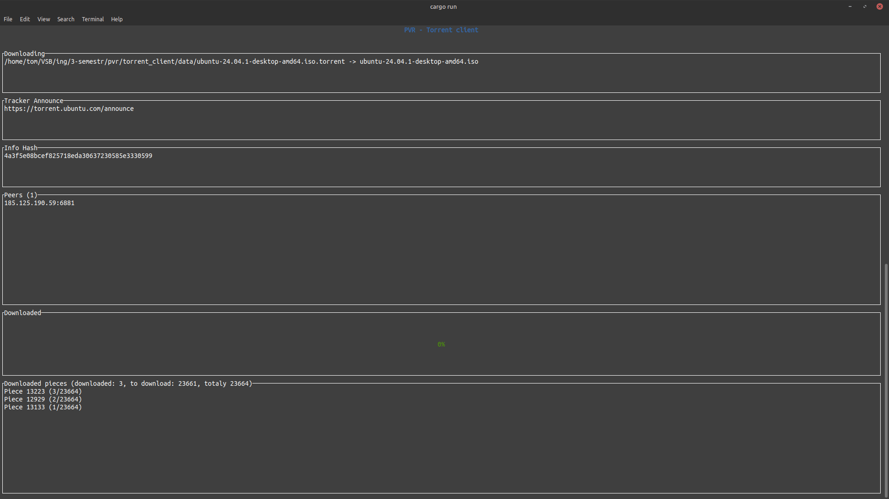

# PVR - Torrent client
This app implements simple torrent client.

## How to run the app
```console
cargo run <path/to/torrent/file.torrent> <optional: path/to/folder/for/result>
```

For example
```console
cargo run ./ubuntu-24.04.1-desktop-amd64.iso.torrent /home/tom/downloads/torrent/
```

## TUI description
After executing the command, following TUI will be shown.

In the first box, path to .torrent file and name of result file is sowh.
In the second box is shown tracker announce.
In the thirt box is shown hex text representation of info hash of downloading file.
Under that is shown list of all peer that client get from tracker based on announce.
Last to boxes show progress bar of downloading, and information which exact pieces are already downloaded.
